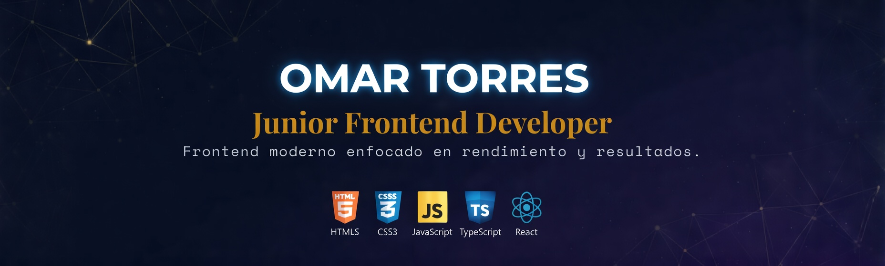

## Hola, soy Omar 👋

- 💻 Desarrollador de Software con experiencia en digitalización de trámites municipales.
- 🌍 De La Paz Este, El Salvador.
- 🧠 Apasionado por Laravel, PHP, JavaScript y el desarrollo web.
---

## 🚀 Tecnologías y Herramientas

## 🛠️ Ofimática y Soporte

---

## 📊 Estadísticas de GitHub

